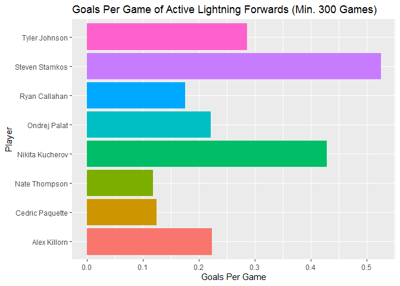
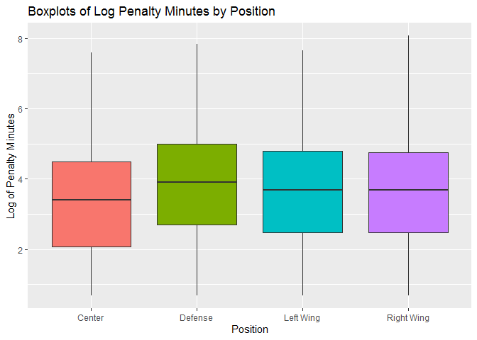
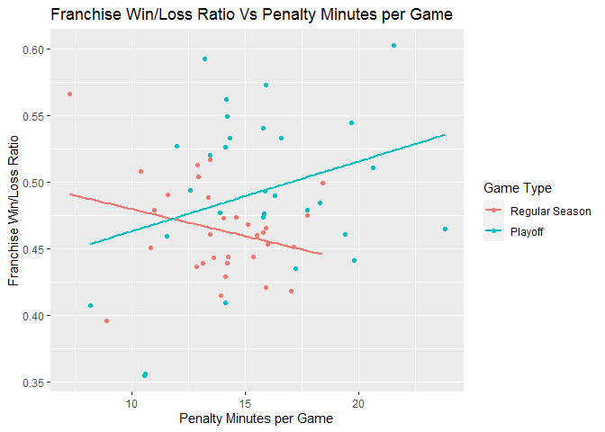

Project 1
================
David Weck
6/6/2020

  - [About JSON](#about-json)
  - [R Packages for JSON](#r-packages-for-json)
  - [Connecting to NHL API](#connecting-to-nhl-api)
  - [EDA on NHL Data](#eda-on-nhl-data)

# About JSON

JSON (short for JavaScript Object Notation) is a format that is used to
store and transfer data. It is text-only format that mirrors the syntax
of JavaScript objects, which allows it to be conveniently read and
written by people. It is comprised of key/value pairs and arrays, which
are structures ubiquitous across nearly all programming languages.
Additionally, JSON requires a relatively small amount of computer
overhead and can be interpreted by virtually all languages. It is these
characteristics that make JSON format an excellent way to store and
transfer data. [(Source)](https://www.json.org/json-en.html) All of
these characteristics also make JSON a very widely used method for data
exchange. Many web applications use JSON to transfer data back and forth
with servers, and APIs often store data in JSON format to allow for easy
retrieval from users. As mentioned earlier, nearly all programming
languages support JSON, further allowing widespread use of the format.
[(Source)](https://www.tutorialspoint.com/json/json_overview.htm)

# R Packages for JSON

There are 3 main packages for reading JSON data into R: `rjson`,
`RJSONIO`, and `jsonlite`. Information on `rjson` and `RJSONIO`,
respectively, can be found
[here](https://cran.r-project.org/web/packages/rjson/rjson.pdf) and
[here](https://cran.r-project.org/web/packages/RJSONIO/RJSONIO.pdf). In
this section, I will be focusing on `jsonlite`. `jsonlite` is an R
package with efficient tools for reading and creating JSON data. I have
chosen it because it is one of the best packages available for
communicating with and retrieving data from APIs through R. One of the
most important functions in `jsonlite` is `fromJSON`. This function
allows for smooth and fast retrieval of JSON data from a JSON string,
URL, or file. Another important function, which is also an argument to
`fromJSON`, is `flatten`. In JSON data, it is common to see data frames
within other data frames. The `flatten` function/argument converts JSON
data with this structure into the 2D structure usually desired for data
frames. There are many other functions that make `jsonlite` an excellent
package for reading JSON data into R. More information about `jsonlite`
can be found
[here](https://cran.r-project.org/web/packages/jsonlite/jsonlite.pdf)

# Connecting to NHL API

This section creates functions to pull data from the NHL API and uses
those functions to create data frames.

``` r
#Function to call /franchise
get_franchise <- function(){
  
  #Initializing variables and creating API call
  base_url <- 'https://records.nhl.com/site/api/' #Setting Base URL
  end <- 'franchise' #Setting end of url
  call <- paste0(base_url, end) #Pasting together
  
  #Creating get request, extracting text, and converting to R object
  get_req <- GET(call)
  text <- content(get_req, as = 'text')
  json <- fromJSON(text, flatten = TRUE)
  
  #Returning final data frame
  return(as.data.frame(json))
}
```

``` r
#Function to call /franchise-team-totals
get_franchise_totals <- function(){
  
  #Initializing variables and creating API call
  base_url <- 'https://records.nhl.com/site/api/' #Setting Base URL
  end <- 'franchise-team-totals' #Setting end of url
  call <- paste0(base_url, end) #Pasting together
  
  #Creating get request, extracting text, and converting to R object
  get_req <- GET(call)
  text <- content(get_req, as = 'text')
  json <- fromJSON(text, flatten = TRUE)
  
  #Returning final data frame
  return(as.data.frame(json))
}
```

``` r
#Function to call /franchise-season-records
get_season_records <- function(ID){
  
  if(is.numeric(ID) & ID %in% 1:38){
  
    #Initializing variables and creating API call
    base_url <- 'https://records.nhl.com/site/api/' #Setting Base URL
    end <- 'franchise-season-records?cayenneExp=franchiseId=' #Setting end of url
    call <- paste0(base_url, end, ID) #Pasting together
  
    #Creating get request, extracting text, and converting to R object
    get_req <- GET(call)
    text <- content(get_req, as = 'text')
    json <- fromJSON(text, flatten = TRUE)
  
    #Returning final data frame
    return(as.data.frame(json))
    
  } else stop('Please enter a valid franchise ID')
}
```

``` r
#Function to call /franchise-goalie-records
get_goalie_records <- function(ID){
  
  if(is.numeric(ID) & ID %in% 1:38){
  
    #Initializing variables and creating API call
    base_url <- 'https://records.nhl.com/site/api/' #Setting Base URL
    end <- 'franchise-goalie-records?cayenneExp=franchiseId=' #Setting end of url
    call <- paste0(base_url, end, ID) #Pasting together
  
    #Creating get request, extracting text, and converting to R object
    get_req <- GET(call)
    text <- content(get_req, as = 'text')
    json <- fromJSON(text, flatten = TRUE)
  
    #Returning final data frame
    return(as.data.frame(json))
    
  } else stop('Please enter a valid franchise ID')
}
```

``` r
#Function to call /franchise-skater-records
get_skater_records <- function(ID){
  
  if(is.numeric(ID) & ID %in% 1:38){
  
    #Initializing variables and creating API call
    base_url <- 'https://records.nhl.com/site/api/' #Setting Base URL
    end <- 'franchise-skater-records?cayenneExp=franchiseId=' #Setting end of url
    call <- paste0(base_url, end, ID) #Pasting together
  
    #Creating get request, extracting text, and converting to R object
    get_req <- GET(call)
    text <- content(get_req, as = 'text')
    json <- fromJSON(text, flatten = TRUE)
  
    #Returning final data frame
    return(as.data.frame(json))
    
  } else stop('Please enter a valid franchise ID')
}
```

``` r
#Creating Data Frames from API calls
franchise <- get_franchise()
franchise_totals <- get_franchise_totals()

#Initializing data frames
season_records <- goalie_records <- skater_records <- NULL

#Looping through all team IDs and combining datasets
for(ID in 1:38){
  
  season_records[[ID]] <- get_season_records(ID)
  
  goalie_records[[ID]] <- get_goalie_records(ID)
  
  skater_records[[ID]] <- get_skater_records(ID)
  
}

season_records <- bind_rows(season_records)
goalie_records <- bind_rows(goalie_records)
skater_records <- bind_rows(skater_records)
```

# EDA on NHL Data

This table shows that most defenders only ever score 1 goal in a game.
We can also see that centers are more likely than other positions to
have games where they score a lot of goals.

``` r
#Creating table of position code and most goals scored in one game
knitr::kable(table(skater_records$data.positionCode, skater_records$data.mostGoalsOneGame),
             caption = 'Table of Most Goals Scored in One Game by Each Position')
```

|   |    0 |    1 |    2 |   3 |   4 |  5 | 6 | 7 |
| - | ---: | ---: | ---: | --: | --: | -: | -: | -: |
| C |  813 | 1514 | 1190 | 530 | 101 | 16 | 5 | 1 |
| D | 1790 | 2830 |  861 | 104 |   9 |  1 | 0 | 0 |
| L |  804 | 1334 |  962 | 481 |  86 |  4 | 1 | 0 |
| R |  702 | 1181 |  966 | 480 |  87 | 18 | 0 | 0 |

Table of Most Goals Scored in One Game by Each Position

This table gives a roster breakdown of each team. It shows how many
players of each position, excluding goalie, each team has on their
current roster.

``` r
#Filtering skaters to active skaters only
active <- filter(skater_records, data.activePlayer == TRUE)

#Creating table of position code by team
knitr::kable(table(active$data.franchiseName, active$data.positionCode),
             caption = 'Table of Position Count by Team')
```

|                       |  C |  D |  L |  R |
| --------------------- | -: | -: | -: | -: |
| Anaheim Ducks         | 23 | 21 | 15 | 15 |
| Arizona Coyotes       | 21 | 21 |  8 |  8 |
| Boston Bruins         | 28 | 22 | 13 | 11 |
| Buffalo Sabres        | 22 | 25 | 17 |  9 |
| Calgary Flames        | 17 | 22 | 12 |  6 |
| Carolina Hurricanes   | 24 | 18 | 12 |  6 |
| Chicago Blackhawks    | 20 | 25 | 13 | 11 |
| Colorado Avalanche    | 22 | 22 | 11 |  8 |
| Columbus Blue Jackets | 30 | 21 | 11 |  8 |
| Dallas Stars          | 17 | 25 | 10 | 10 |
| Detroit Red Wings     | 13 | 19 | 14 | 11 |
| Edmonton Oilers       | 19 | 26 | 12 |  8 |
| Florida Panthers      | 22 | 20 |  5 | 12 |
| Los Angeles Kings     | 20 | 21 | 11 |  9 |
| Minnesota Wild        | 21 | 19 |  7 |  9 |
| Montréal Canadiens    | 17 | 27 | 12 |  8 |
| Nashville Predators   | 19 | 20 |  9 | 11 |
| New Jersey Devils     | 20 | 19 | 13 | 11 |
| New York Islanders    | 15 | 19 | 10 | 10 |
| New York Rangers      | 22 | 22 | 11 |  9 |
| Ottawa Senators       | 28 | 19 | 12 | 15 |
| Philadelphia Flyers   | 22 | 17 |  8 | 11 |
| Pittsburgh Penguins   | 29 | 26 | 12 | 10 |
| San Jose Sharks       | 21 | 21 |  5 |  6 |
| St. Louis Blues       | 14 | 22 | 10 |  9 |
| Tampa Bay Lightning   | 22 | 15 |  6 |  8 |
| Toronto Maple Leafs   | 20 | 25 | 14 | 10 |
| Vancouver Canucks     | 22 | 23 |  9 |  7 |
| Vegas Golden Knights  | 14 | 14 | 10 |  5 |
| Washington Capitals   | 12 | 19 | 12 |  9 |
| Winnipeg Jets         | 16 | 21 | 14 |  8 |

Table of Position Count by Team

``` r
#Filtering  skater records down to active Lightning forwards with min 300 games
active <- skater_records %>% 
  filter(data.activePlayer == TRUE, 
         data.gamesPlayed >= 300, 
         data.positionCode != 'D',
         data.franchiseId == 31) %>%
  mutate(fullName = paste(data.firstName, data.lastName, sep = ' '), #Merging first and last name
         goalsPerGame = data.goals / data.gamesPlayed)   #Creating goals per game stat

#Creating plot object and bar chart of goals per game
g <- ggplot(active, aes(x = fullName, y = goalsPerGame))
g + geom_bar(aes(fill = fullName), stat = 'identity', show.legend = FALSE) + 
  coord_flip() +
  labs(x = 'Player', y = 'Goals Per Game', 
       title = 'Goals Per Game of Active Lightning Forwards (Min. 300 Games)')
```

<!-- -->

I created goals per game statistic to get an understanding of which
players are the most efficient scorers. Steven Stamkos and Nikita
Kucherov stand out as the most efficient goal scorers among active
Lightning players. Stamkos, remarkably, scores a goal every two games.

``` r
#Creating box-plot of log penalty minutes by position
#Using log scale because distribution is very skewed
h <- ggplot(skater_records, aes(x = data.positionCode, y = log(data.penaltyMinutes)))
h + geom_boxplot(aes(fill = data.positionCode), show.legend = FALSE) +
  scale_x_discrete(labels = c('Center', 'Defense', 'Left Wing', 'Right Wing')) +
  labs(x = 'Position', y = 'Log of Penalty Minutes', 
       title = 'Boxplots of Log Penalty Minutes by Position')
```

<!-- -->

This plot displays boxplots of log career penalty minutes by position. I
used log penalty minutes because the distribution of penalty minutes is
so heavily skewed. As you can see, it appears defenders generally
accumulate slightly more penalty minutes in their careers than other
positions. Centers appear to accumulate slightly less penalty minutes.
The player with the most penalty minutes in his career was a Right Wing.

``` r
#Filtering to include current teams only and creating per game stats
current <- franchise_totals %>%
  filter(is.na(data.lastSeasonId)) %>%
  mutate(penaltyMinutesPerGame = data.penaltyMinutes / data.gamesPlayed,
         winRatio = data.wins / data.gamesPlayed)

#Changing game type into a factor
current$data.gameTypeId <- as.factor(current$data.gameTypeId)
         
#Plotting scatterplot and fitted lines
l <- ggplot(current, aes(x = penaltyMinutesPerGame, y = winRatio))
l + geom_point(aes(color = data.gameTypeId)) +
  geom_smooth(aes(group = data.gameTypeId, color = data.gameTypeId), method = 'lm', se = FALSE) +
  scale_color_discrete(name = 'Game Type', 
                      labels = c('Regular Season', 'Playoff')) +
  labs(x = 'Penalty Minutes per Game', y = 'Franchise Win/Loss Ratio',
       title = 'Franchise Win/Loss Ratio Vs Penalty Minutes per Game')
```

<!-- -->

From this plot, we can see that in the regular season, franchises with
more penalty minutes per game tend to have a lower overall win-loss
ratio. The opposite seems tends to be the case in the playoffs, although
the correlation is quite low in both cases.
